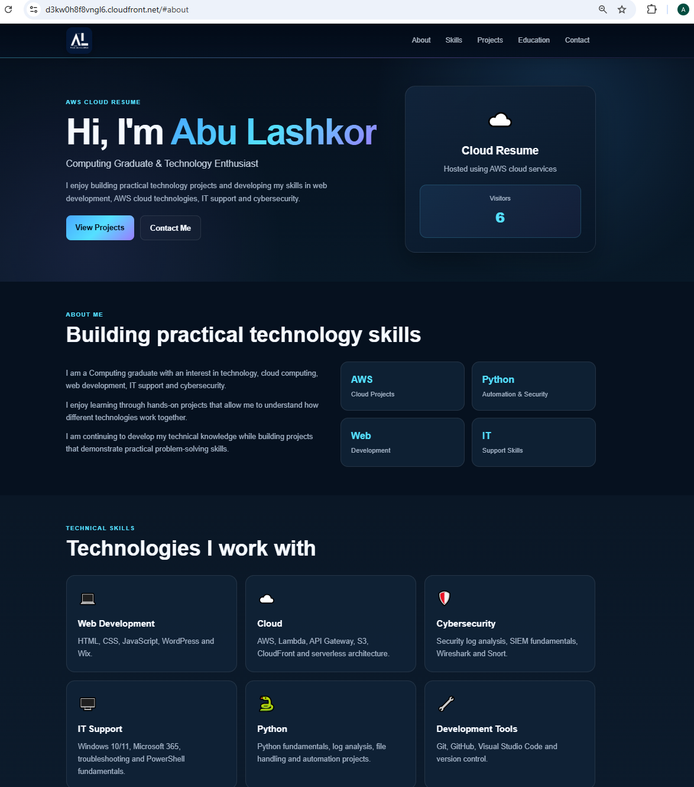

# AWS Cloud Resume

A responsive cloud-hosted resume website built with HTML, CSS and JavaScript and deployed using AWS serverless services.

The project includes a live visitor counter powered by API Gateway, AWS Lambda and DynamoDB.

## Live Demo

[View the Live AWS Cloud Resume](https://d3kw0h8f8vngl6.cloudfront.net)

## Screenshot



## Project Overview

This project demonstrates how a front-end website can be combined with AWS cloud services to create a simple serverless application.

The website is stored in Amazon S3 and delivered through Amazon CloudFront. When a visitor opens the website, JavaScript calls an Amazon API Gateway endpoint.

API Gateway invokes an AWS Lambda function written in Python. The Lambda function updates the visitor count stored in Amazon DynamoDB and returns the latest count to the website.

The visitor number is then displayed dynamically on the homepage.

## Architecture

```text
Visitor
   │
   ▼
Amazon CloudFront
   │
   ▼
Amazon S3
   │
   ▼
HTML / CSS / JavaScript
   │
   ▼
Amazon API Gateway
   │
   ▼
AWS Lambda
   │
   ▼
Amazon DynamoDB
```

## AWS Services Used

### Amazon S3

Stores the static website files including:

- HTML
- CSS
- JavaScript
- Images

### Amazon CloudFront

Provides the public website endpoint and distributes the website through AWS's content delivery network.

CloudFront caching is invalidated when updated website files are deployed.

### Amazon API Gateway

Provides an HTTP API endpoint used by the website to communicate with the Lambda function.

The visitor counter uses:

```text
GET /visitors
```

### AWS Lambda

The Python Lambda function receives the API request and updates the visitor counter.

It performs an atomic DynamoDB update so the count increases each time the visitor API is called.

### Amazon DynamoDB

Stores the visitor counter using a simple item:

id: visitors
count: number

### AWS IAM

The Lambda execution role uses permissions required for:

- writing Lambda logs
- updating the visitor counter in DynamoDB

The DynamoDB permission is restricted to the visitor counter table.

## Technologies

**Frontend**

- HTML5
- CSS3
- JavaScript
- Responsive Web Design

**Backend**

- Python
- AWS Lambda
- Amazon API Gateway
- Amazon DynamoDB

**Cloud**

- Amazon S3
- Amazon CloudFront
- AWS IAM

**Development**

- Git
- GitHub
- Visual Studio Code

## Project Structure

```text
aws-cloud-resume/
│
├── frontend/
│   ├── index.html
│   ├── style.css
│   ├── script.js
│   └── al-logo.png
│
├── backend/
│   └── lambda_function.py
│
└── README.md
```

## Visitor Counter Flow

When someone visits the website:

1. CloudFront delivers the website stored in Amazon S3.
2. JavaScript sends a request to the API Gateway `/visitors` endpoint.
3. API Gateway invokes the Lambda function.
4. Lambda updates the visitor count in DynamoDB.
5. DynamoDB returns the updated value.
6. Lambda sends the result back through API Gateway.
7. JavaScript displays the visitor count on the homepage.

## Lambda Function

The backend is written in Python using `boto3`.

The Lambda function updates the DynamoDB counter using:

```python
UpdateExpression="ADD #count :increase"
```

This allows DynamoDB to increment the visitor count without needing to retrieve and manually calculate the previous value first.

## Responsive Design

The website includes:

- responsive desktop and mobile layouts
- mobile navigation menu
- smooth scrolling
- active navigation highlighting
- dynamic navigation styling
- responsive project cards
- live visitor counter

## What I Learned

Building this project helped me develop practical experience with:

- hosting static websites with Amazon S3
- using CloudFront to distribute web content
- creating HTTP APIs with API Gateway
- building Python Lambda functions
- storing and updating data in DynamoDB
- configuring IAM permissions
- connecting front-end JavaScript to serverless AWS services
- deploying and updating cloud-hosted applications
- using Git and GitHub for version control

## Security

The project uses IAM permissions to control access between AWS services.

The Lambda function is given permission to update only the required DynamoDB table rather than broad access to DynamoDB resources.

No AWS access keys or secret credentials are stored in the repository.

## Future Improvements

Possible future improvements include:

- custom domain name
- HTTPS certificate with AWS Certificate Manager
- infrastructure as code
- automated CI/CD deployment
- CloudWatch monitoring and alarms
- automated testing

## Author

**Abu Lashkor**

GitHub: [Cloud9din](https://github.com/Cloud9din)

LinkedIn: [Abu Lashkor](https://www.linkedin.com/in/abu-lashkor-al2024/)
